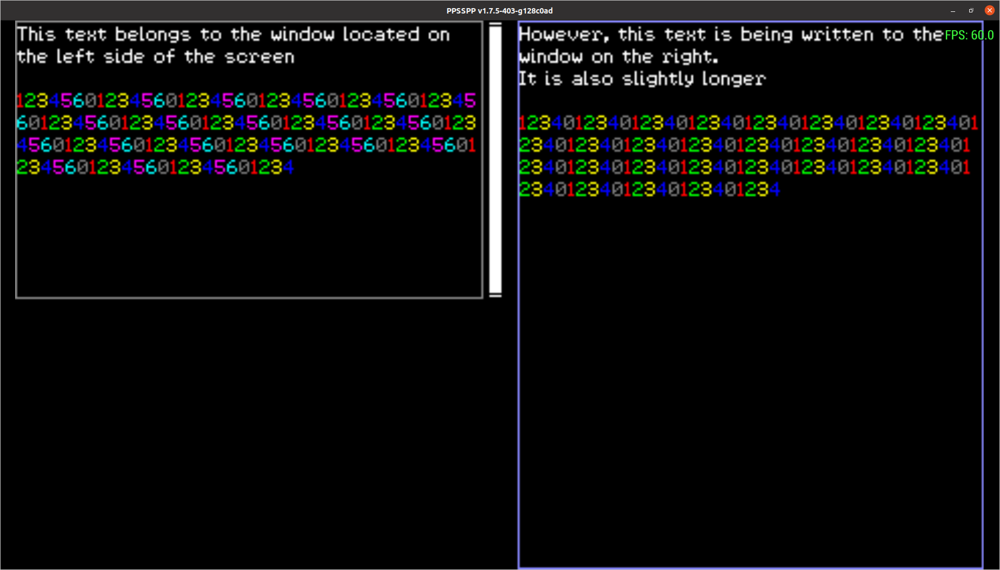

# PSP Pretty Print

PSP Pretty Print (PSPP) is a small library whose purpose is to extend the basic print-to-screen functionality provided by the PSPSDK.

PSPP provides:
- Simple usage.
- Screen update on-demand.
- Colors.
- Uses wchar to support any character set.
- Uses windows as abstractions. Text is fit to be displayed in these windows.
- Text-wrapping.
- User-defined behaviour when a text buffer reaches its defined limit.
- Text scroll.
- Scrollbars to display progress.
- Custom fonts. The library provides a default font set that prints the ASCII character set, Spanish specific characters and special characters for escape characters (these aren't printed by default).
- A Python script to create these fonts using a sprite atlas as source.

## Still example

The provided main file outputs the following:

## Animated example

